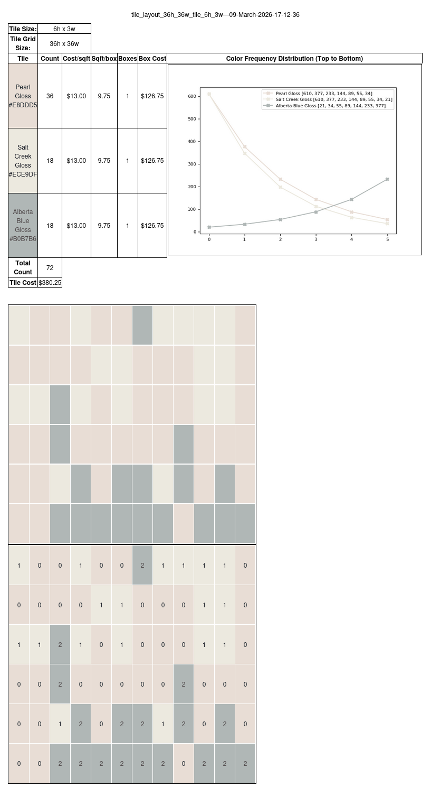

# tiles
A ceramic tile pattern generator

Tiles uses a YAML configuration file named `config.yaml` to generate
random ceramic tile patterns. The following is a sample configuration:

```
# Set locale for proper currency and html formatting.
locale: 'en_US.UTF-8'

# Height in inches.
height: 36

# Width in inches.
width: 36

# Tile dimensions in inches.
tile_size_h: 6
tile_size_w: 3

# Name, Cost per Box, Box Minimum (sqft/box), Hex Color Equivalent for Tile Color, Color Weight Array with weights indicating color frequencies from top to bottom of tile grid.
tiles: [
 ['Pearl Gloss', 13, 9.75, '#E8DDD5', [ 610, 377, 233, 144, 89, 55, 34 ]],
 ['Salt Creek Gloss', 13, 9.75, '#ECE9DF', [ 610, 377, 233, 144, 89, 55, 34, 21 ]],
 ['Alberta Blue Gloss', 13, 9.75, '#B0B7B6',  [ 21, 34, 55, 89, 144, 233, 377 ]],
]
```

This file sets up a 6' x 6' pattern with 3 colors with varying color
weights defined top to bottom, using 6x3 tiles. Any number of colors are
possible, using a rectangular tile size of your choice. The tile pattern
size will be adjusted to handle the minimum whole number of tiles
necessary to cover the requested pattern & tile size.

This configuration will produces an HTML file with a pattern
like the following:

 


## Installation & usage
Ubuntu/Debian user can install the necessary python modules with:
```bash
  sudo apt install -y python3-yaml python3-jinja2 python3-numpy \
  python3-matplotlib
```
Open the generated output file in `output/` in your browser and refresh as needed.

## License
```
MIT License

Copyright (c) 2016 James Moore & 2026 Satadru Pramanik

Permission is hereby granted, free of charge, to any person obtaining a copy
of this software and associated documentation files (the "Software"), to deal
in the Software without restriction, including without limitation the rights
to use, copy, modify, merge, publish, distribute, sublicense, and/or sell
copies of the Software, and to permit persons to whom the Software is
furnished to do so, subject to the following conditions:

The above copyright notice and this permission notice shall be included in all
copies or substantial portions of the Software.

THE SOFTWARE IS PROVIDED "AS IS", WITHOUT WARRANTY OF ANY KIND, EXPRESS OR
IMPLIED, INCLUDING BUT NOT LIMITED TO THE WARRANTIES OF MERCHANTABILITY,
FITNESS FOR A PARTICULAR PURPOSE AND NONINFRINGEMENT. IN NO EVENT SHALL THE
AUTHORS OR COPYRIGHT HOLDERS BE LIABLE FOR ANY CLAIM, DAMAGES OR OTHER
LIABILITY, WHETHER IN AN ACTION OF CONTRACT, TORT OR OTHERWISE, ARISING FROM,
OUT OF OR IN CONNECTION WITH THE SOFTWARE OR THE USE OR OTHER DEALINGS IN THE
SOFTWARE.

```
